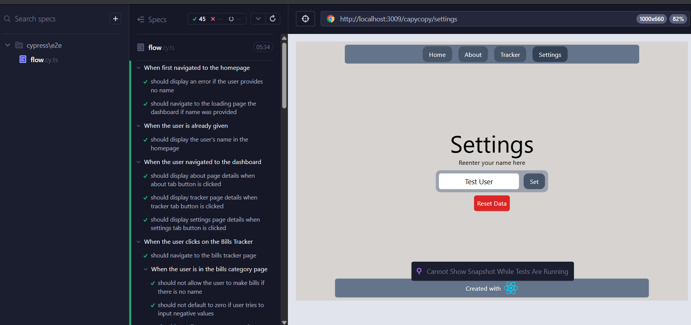

# Testing

This was forked from @wends05 's repo CapyCopy with permission.
This fork is only for testing purposes only. This project _does_ not utilized a database and relies on _Local Storage_


## Testing Installation

1. clone this repository

```bash
git clone
```

2. install the dependencies

```bash
npm install
```

3. run the 'development' server first (needed to be running in order for cypress to run tests properly)

```bash
npm run dev
```

4. run the cypress test

```bash
 npm run test:cypress
```

5. navigate to the e2e and click on 'flow.cy.ts' which covers the major functionality of copycapy

6. test coverage _Please read this_

Anton -> up to the tracker
Sheena -> (TO DO) Settings

# React + TypeScript + Vite

This template provides a minimal setup to get React working in Vite with HMR and some ESLint rules.

Currently, two official plugins are available:

- [@vitejs/plugin-react](https://github.com/vitejs/vite-plugin-react/blob/main/packages/plugin-react/README.md) uses [Babel](https://babeljs.io/) for Fast Refresh
- [@vitejs/plugin-react-swc](https://github.com/vitejs/vite-plugin-react-swc) uses [SWC](https://swc.rs/) for Fast Refresh

## Expanding the ESLint configuration

If you are developing a production application, we recommend updating the configuration to enable type aware lint rules:

- Configure the top-level `parserOptions` property like this:

```js
export default {
  // other rules...
  parserOptions: {
    ecmaVersion: 'latest',
    sourceType: 'module',
    project: ['./tsconfig.json', './tsconfig.node.json'],
    tsconfigRootDir: __dirname,
  },
}
```

- Replace `plugin:@typescript-eslint/recommended` to `plugin:@typescript-eslint/recommended-type-checked` or `plugin:@typescript-eslint/strict-type-checked`
- Optionally add `plugin:@typescript-eslint/stylistic-type-checked`
- Install [eslint-plugin-react](https://github.com/jsx-eslint/eslint-plugin-react) and add `plugin:react/recommended` & `plugin:react/jsx-runtime` to the `extends` list
